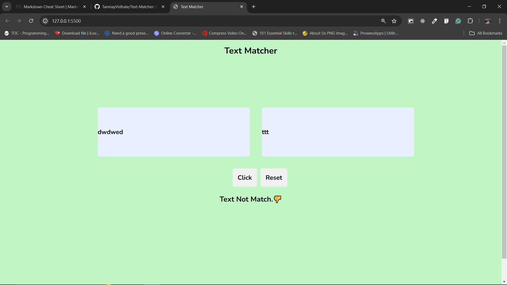
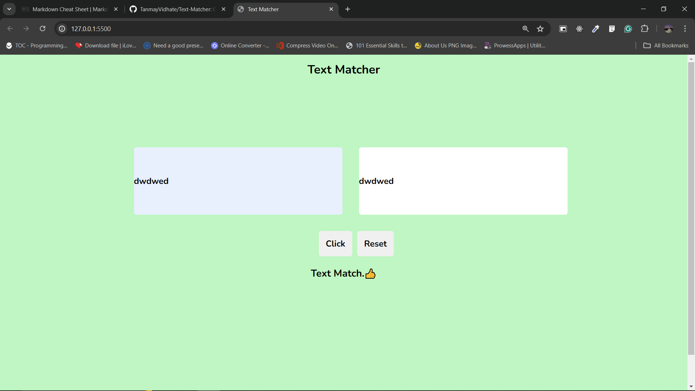

# Text Matcher App 

The Applications is use for to check both text are equal  or not.```HTML```,```CSS```,```JavaScript``` those technology are use to made this applications.When User Click on button then onclick event call the function.

In function logic check the both text if it same then it give the message text is match otherwise it give message text does not match.

---

---
